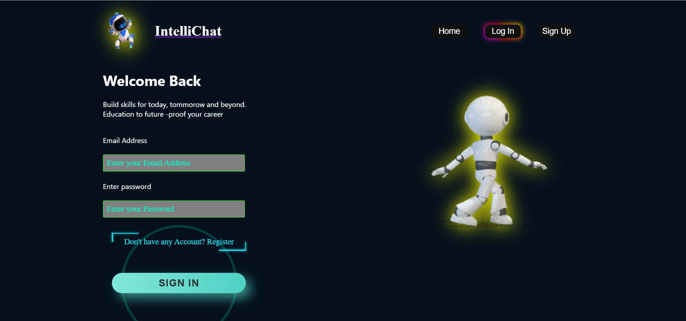
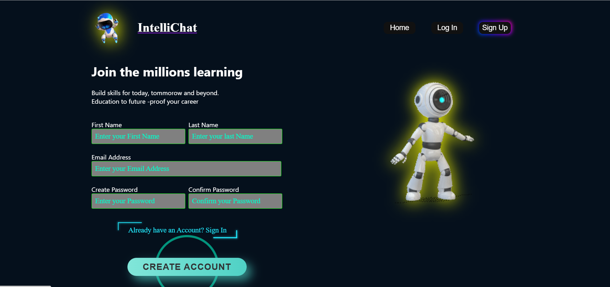
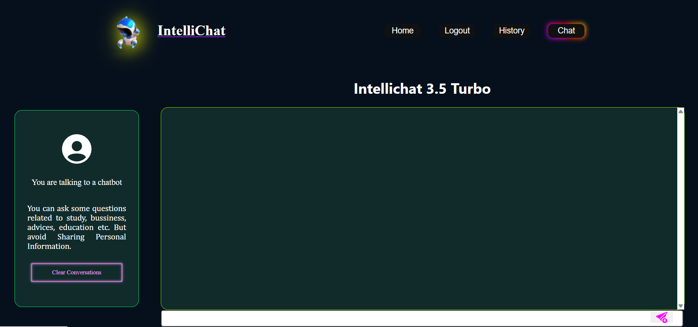
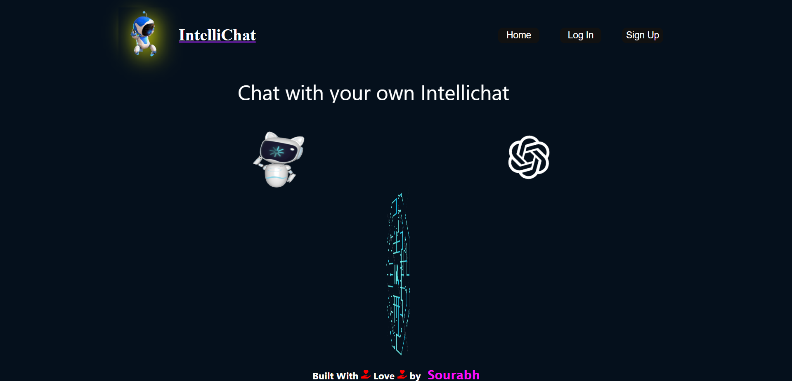
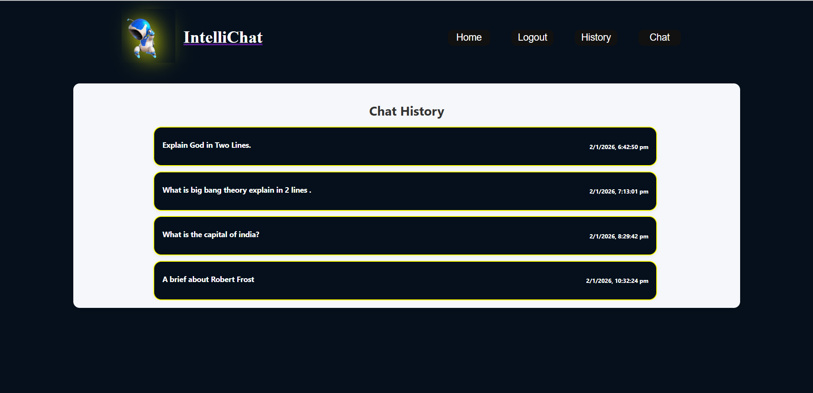

## 🤖 Intellichat – MERN Stack AI Chat Application

*Intellichat is a full-stack MERN application that allows users to authenticate and chat with an AI powered by Google AI Studio (Gemini API).*

*Both frontend and backend run together using a single command with concurrently.*

**🚀 Features**

  1. 🔐 User Authentication (Signup / Login / Logout)

  2. 💬 AI-powered chat using Google AI Studio (Gemini API)

  3. 🧹 Clear chat conversations

  4. 🕒 View chat history with date & time

  5. 👤 User-specific chat storage

  6. ⚡ Single-command startup for frontend & backend

**🛠 Tech Stack**

   1. Frontend

     * React.js

     * Axios

     * React Router

     * React Toastify

     * CSS

   2. Backend

     * Node.js

     * Express.js

     * MongoDB

     * Mongoose

     * JWT Authentication

     * bcrypt

     * AI

     * Google AI Studio (Gemini API)

**📁 Project Structure**

Chat-gpt-clone/
│
├── client/                  # React frontend
│   ├── public/
│   ├── src/
│   └── package.json
│
├── controllers/              # Backend controllers
├── routes/                   # API routes
├── models/                   # Mongoose models
├── middleware/               # Auth & other middleware
│
├── node_modules/
├── .env                      # Environment variables
├── .gitignore
├── server.js                 # Express server entry point
├── package.json              # Backend + concurrently config
└── package-lock.json

## 📝 This project uses concurrently to run both frontend and backend with a single command.

**⚙️ Environment Variables**

 - PORT=4000
 - MONGO_URI=your_mongodb_connection_string
 - JWT_SECRET=your_jwt_secret
 - GOOGLE_AI_STUDIO_ENDPOINT=google_ai_studio_endpoint
 - GOOGLE_AI_STUDIO_API_KEY=your_google_ai_studio_api_key

 **🧪 Installation & Setup**

 1️⃣ Clone the repository
   - git clone https://github.com/Sourabh108-Coder/Intellichat.git
   - cd Chat-gpt-clone

 2️⃣ Install dependencies
   - npm install
   - cd client
   - npm install
   - cd ..

 3️⃣ Run the application (Frontend + Backend)
   - npm run dev

 4️⃣ Backend runs on: http://localhost:4000

 5️⃣ Frontend runs on: http://localhost:3000

**🧠 AI Chat Flow**

   1. User submits a message

   2. Backend sends it to Google AI Studio (Gemini API)

   3. AI response is returned

   4. Chat is stored in MongoDB with timestamps

   5. User can view chat history anytime

**📸 Screenshots**

### 🔐 Login Page

### 📝 Signup Page

### 📜 Chat Interface

### 🏠 Home Page

### 🕒 Histroy Page

**👨‍💻 Author**
  ## - *Sourabh* (https://github.com/Sourabh108-Coder)

